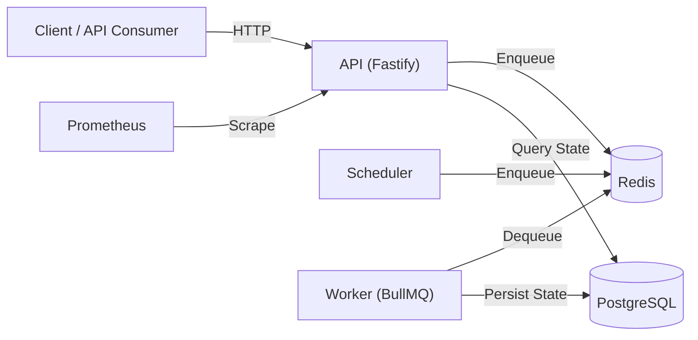

# Dispatch Architecture

## System Diagram

## Component Responsibilities

### API (`apps/api`)
- HTTP server for job management, authentication, and metrics
- Validates all inputs with Zod
- Enforces tenant isolation and RBAC
- Exposes `/health`, `/ready`, and `/metrics` probes

### Worker (`apps/worker`)
- BullMQ worker processes for `jobs-default`, `jobs-workflow`, and `jobs-dlq`
- Executes job handlers as pure functions
- Classifies failures and routes exhausted jobs to DLQ
- Graceful shutdown on SIGTERM

### Scheduler (`apps/scheduler`)
- Lightweight background process
- Scans `job_definitions` for recurring jobs
- Creates `job_executions` and enqueues them to BullMQ with cron repeat rules
- Deduplicates: skips if a waiting execution already exists for the definition

### Shared Packages
- `@dispatch/db` — Prisma client and schema
- `@dispatch/queue` — BullMQ connection, queue definitions, Zod job schemas
- `@dispatch/logger` — Pino factory with structured context
- `@dispatch/config` — Zod-validated environment variables
- `@dispatch/shared` — Result type, DispatchError, tenant scope helpers

## Data Flow: Trigger → Execute → Verify

1. **Trigger:** Client calls `POST /v1/job-definitions/:id/trigger` with optional `Idempotency-Key`.
2. **Persist:** API creates a `job_execution` row with status `scheduled`.
3. **Enqueue:** API adds a BullMQ job with a deterministic ID `{tenantId}:{defId}:{idempotencyKey}`.
4. **Transition:** Worker picks up the job, updates execution to `active`, runs the handler.
5. **Complete:** On success, execution becomes `completed`. On failure, it becomes `retrying` or `failed`.
6. **DLQ:** After max attempts, the job is moved to `jobs-dlq` and status set to `dead_lettered`.
7. **Replay:** Client calls `POST /v1/executions/:id/retry` to create a new execution from a failed one.
